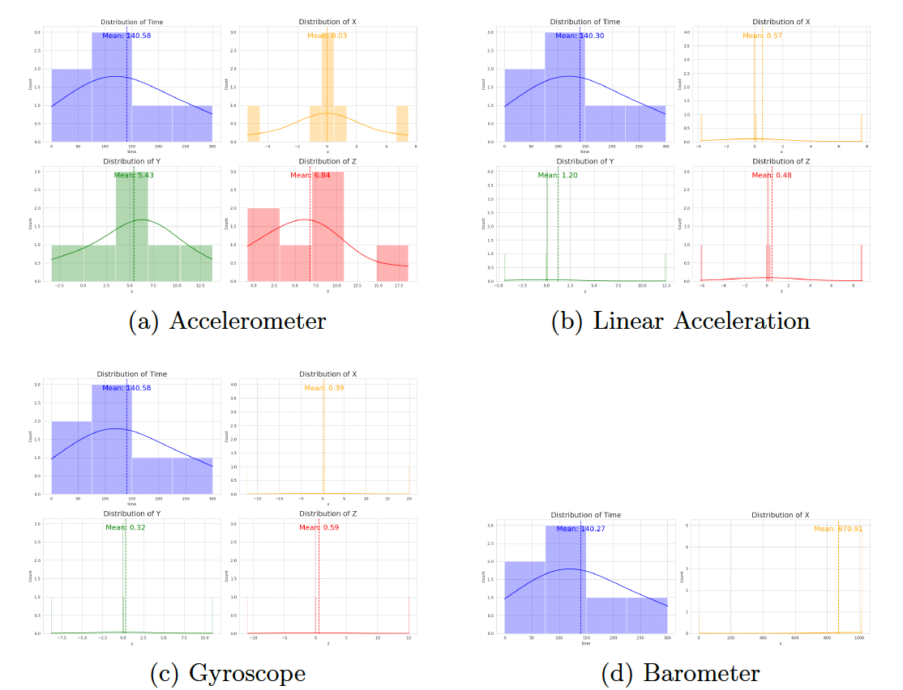
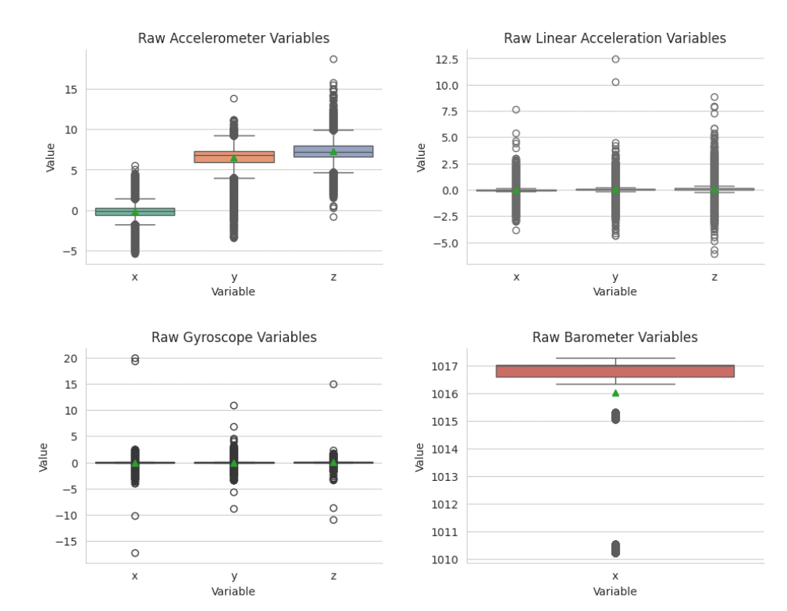
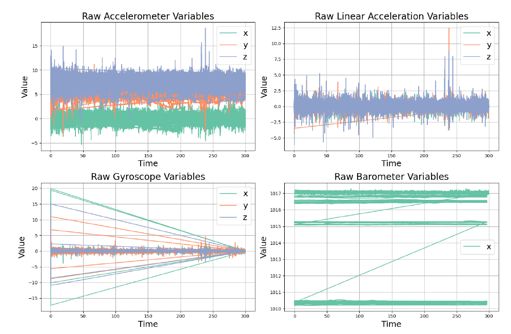
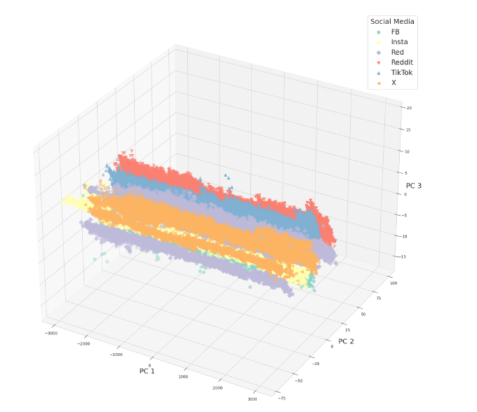
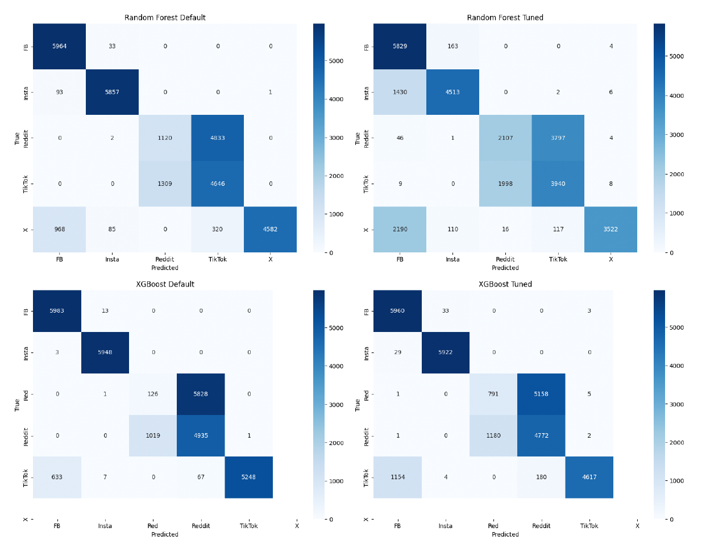
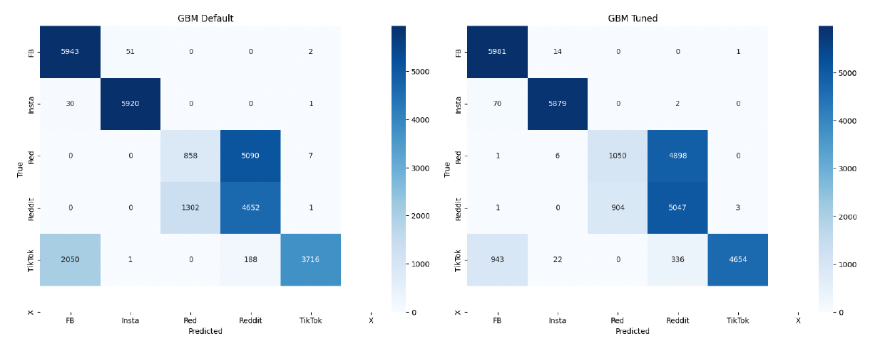
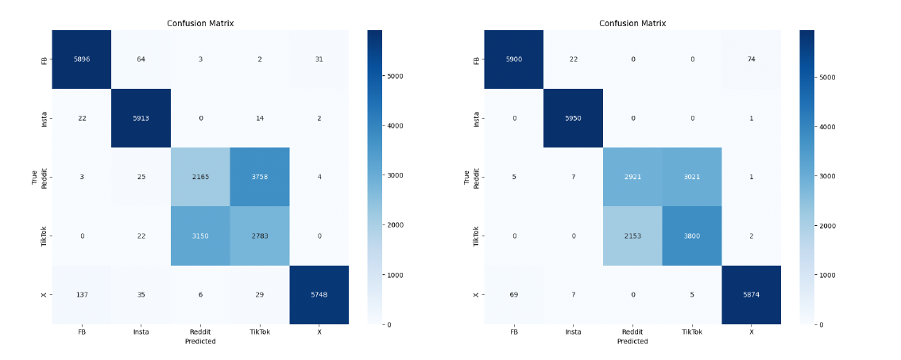
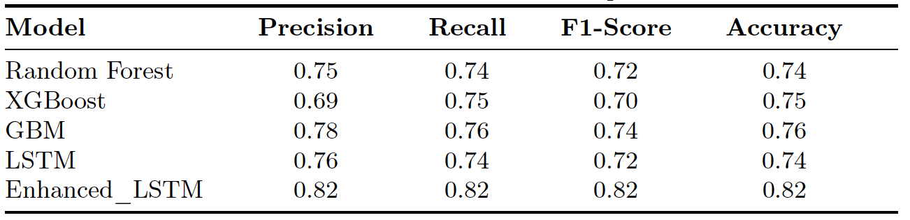
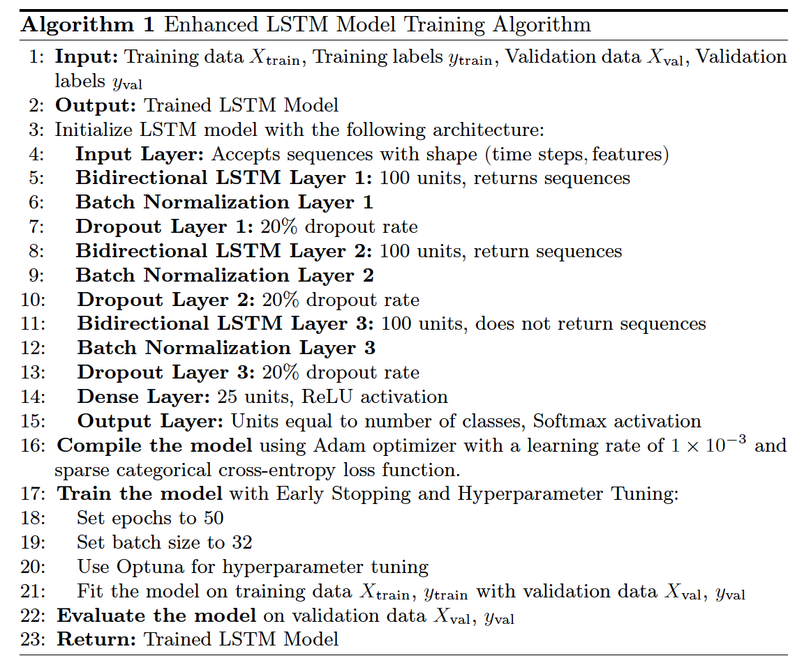

# Predicting Social Media Interaction Using Smartphone Sensors

This project explores whether internal smartphone sensor data can predict which social media platform a user is interacting with. Using sensor recordings collected via the Phyphox app, machine learning models and LSTM networks were trained to classify user behavior.

---

## 📁 Project Structure

| File/Folder              | Description                                      |
|--------------------------|--------------------------------------------------|
| `social_media_sensor_prediction.ipynb` | Main analysis and modeling notebook           |
| `requirements.txt`       | List of python packages needed                   |
| `images/`                | Visualizations of results              |

---

## 🚀 Getting Started

### Clone the repository

```bash
git clone https://github.com/ES870/social-media-sensor-prediction.git
```

### Install required packages
```bash
pip install -r requirements.txt
```

### Run the notebook
```bash
jupyter notebook
```
---

## 🧠 Methods & Techniques

- Feature engineering and dimensionality reduction (PCA)
- Classical ML models (Random Forest, XGBoost, GBM)
- LSTM deep learning model for sequence prediction

---

## ✅ Results
- The optimized LSTM achieved an 82% classification accuracy.
- Demonstrated that platform-specific user behavior can be predicted using only internal sensor data.

---

## 📊 Key Visuals

### 🔹 Sensor Data Distributions

  
*Figure 1: Distribution of raw X, Y, Z, and time readings for accelerometer, linear acceleration, gyroscope, and barometer sensors.*

---

### 🔹 Boxplots of All Variables

  
*Figure 2: Boxplots for all raw sensor features before preprocessing, highlighting outliers and variability.*

---

### 🔹 Time-Series Signal Patterns

  
*Figure 4: Raw time series plots across sensor types, showing differences between users and devices.*

---

### 🔹 PCA Dimensionality Reduction

  
*Figure 5: Variance explained by the top 3 PCA components. Used to explore low-dimensional structure in sensor data.*

---

### 🔹 Confusion Matrices for Tree-Based Models

  
*Figure 6: Confusion matrices before and after tuning for Random Forest and XGBoost models.*

---

### 🔹 GBM Confusion Matrices

  
*Figure 7: Confusion matrices for the Gradient Boosting Model (GBM) using default (left) and Optuna-tuned (right) hyperparameters, showing improved classification accuracy across social media platform classes.*

### 🔹 Enhanced LSTM Confusion Matrices

  
*Figure 8: Pre- and post-tuning confusion matrices for the Enhanced LSTM deep learning model.*

---

### 🔹 Final Model Performance

  
*Table 4: Precision, recall, F1-score, and accuracy across all evaluated models.*

---

### 🔹 LSTM Architecture

  
*Algorithm 1: Overview of the Enhanced LSTM architecture used for classifying social media platform usage.*

---
## 📬 Contact
For questions or collaboration, feel free to reach out via [my homepage](https://estock2.wixsite.com/evastock/portfolio).


